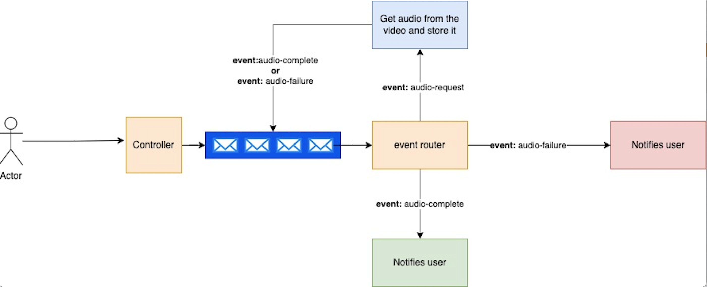

# Paranda

Paranda is a video summarizer generator. Just add your video URL and it would summarize the video for you.

## Features

* User should be able to get a video transcript by passing a video URL
* User should be able to review the progress
* User should be able to get the event history

### Design

Paranda focuses on three events right now:

* Audio Request | This event is triggered when a user requests a video audio
* Audio Request Complete | This event is triggered when the audio is ready
* Audio Request Failed | This event is triggered when the audio request fails



### APIs

[API specs](./api_spec.yml)

Submit a video request for summarization:

```bash
curl --request POST \
  --url http://localhost:3000/v1/videos \
  --header 'Content-Type: application/json' \
  --data '{
	"url": "https://www.youtubecom/watch?v=3sSfNURU_b4",
	"user": "johndoe@gmail.com"
}'
```

Check video request status

```bash
    curl --request GET \
    --url http://localhost:3000/v1/videos/5idu0kjfdqk
```

Get event history

```bash
curl --request GET \
  --url http://localhost:3000/v1/events
```

## Run locally

### Docker

The easiest way to run locally is using the docker container

In the root directory

Run redis:

```bash
docker run -p 6379:6379 --name myredis  redis
```

Run mongo

```bash
docker run --name paranda-mongo -p 27017:27017 -e MONGO_INITDB_ROOT_USERNAME={} -e MONGO_INITDB_ROOT_PASSWORD={} mongo
```

```bash
npm run dev
```

## Development

Start by installing all the dependencies

```bash
npm i
```

Run code in dev mode

```bash
npm run dev
```

### Run tests


### Contribution

To contribute to the development of this API, please follow these steps:

* Clone the forked repository to your local machine
* Create a new branch for your changes
* Make your changes and commit them
* Push the changes to your GitHub repository
